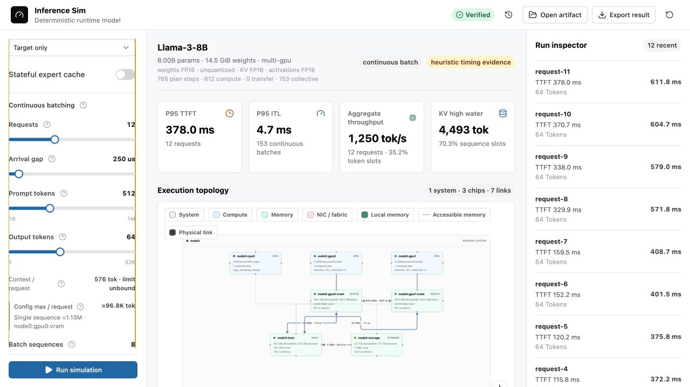

# inference-sim

A deterministic simulator for LLM inference placement, memory protocols, and
resource scheduling.

The project is intentionally split between exact protocol checks and calibrated
performance estimates. It can prove ledger and state-transition properties; it
does not claim hardware-accurate latency without calibration data.

**Live workbench:** [justinchuby.com/inference-sim](https://www.justinchuby.com/inference-sim/)

## What You Can Model

- Import local ONNX model packages directly in the browser, including external
  tensor data and onnx-genai inference metadata for multi-model pipelines.
- Inspect model size, parameter count, weight/activation dtype, quantization
  down to INT2/INT1, estimated FLOPs, active-weight traffic, and theoretical
  compute and bandwidth roofs.
- Build or edit one- to four-node device topologies with separate compute,
  VRAM/RAM/unified-memory/SSD domains, resource-manager capacity limits, and
  selectable PCIe, fabric, Ethernet, or RDMA links.
- Simulate target-only and supported speculative decode families, continuous
  batching, chunked prefill, MoE placement and expert caching, TP/PP/EP/DP,
  multimodal pipelines, and optional SSD streaming.
- Explore prompts up to 1M tokens and outputs up to 32K tokens with logarithmic
  controls. The workbench estimates the selected configuration's per-request
  and single-sequence context capacity from model KV geometry, model residency,
  placement, sharding, and user allocation limits.
- Read replay-verified latency, TTFT/ITL, throughput, memory pressure, resource
  utilization, roofline, topology, and confidence/provenance evidence; export
  the complete deterministic result and import it later for verification.

The browser workbench is a static application. Model files stay local and are
decoded and hashed in dedicated Web Workers; simulation does not require an
inference server or upload model data.



## Direction

The simulation model is being built around the onnx-genai memory and
distributed-runtime contracts. Planned scenarios cover:

- CPU-only;
- discrete GPU plus CPU;
- multi-GPU;
- GPU plus NPU;
- unified memory; and
- multi-node and heterogeneous execution.

Speculative decoding is a first-class workload model. It covers
prompt-lookup, draft-model, MTP, EAGLE-3, shared-KV, and self-speculative
proposers with target-authoritative verification and composite checkpoint
restore. Self-speculative is modeled as a design projection because the current
onnx-genai runtime does not expose it as a released proposer mode.

## Simulation Scale

Long-context inputs do not expand into one event per prompt token: chunked
prefill is represented as exact aggregate token work per scheduled batch.
Repeated stateless serving batches compile into immutable relative-time
topology templates, while request scheduling, batch membership, token
timestamps, KV accounting, and completion times remain exact. Aggregate
operation and utilization metrics multiply each template's reservations by its
exact occurrence count instead of rescanning duplicate plans.

The test suite includes a 1,048,576-token chunked prompt and a lossless 32,768
output-token trace. A 32-request by 4,096-output-token stress case (131,072
generated tokens) is also used during performance validation. Stateful MoE
residency, expert prefetch, SSD streaming, and shared physical-resource paths
are deliberately simulated batch by batch and are never accelerated by the
stateless template cache. Wall-clock runtime depends on the browser and host;
these workloads are correctness and scalability guards, not hardware latency
benchmarks.

## Development

### Setup

```bash
pnpm install --frozen-lockfile
pnpm build
pnpm test
```

Start the local workbench:

```bash
pnpm dev:web
```

### Common CLI Workflows

List and inspect device scenarios:

```bash
pnpm sim presets
pnpm sim scenario multi-gpu-ring-4
pnpm sim scenario /path/to/custom-scenario.yaml
```

Inspect an ONNX model package and run static memory analysis:

```bash
pnpm sim onnx-inspect /path/to/model.onnx /path/to/manifest.json
pnpm sim static examples/mixtral-dgx-h100.yaml
```

Run serving, speculative decoding, and expert-cache workloads:

```bash
pnpm sim serving multi-gpu examples/serving.yaml
pnpm sim serving multi-gpu examples/serving-speculative.yaml
pnpm sim speculative examples/speculative-mtp.yaml
pnpm sim expert-cache examples/expert-cache.yaml
```

Compare topologies or exercise failure protocols:

```bash
pnpm sim serving-compare examples/serving-speculative.yaml
pnpm sim compare examples/target-only.yaml
pnpm sim fault-campaign multi-gpu examples/target-only.yaml
pnpm sim node-failover multi-node single-gpu-cpu examples/node-failover.yaml
```

Use `pnpm sim --help` for the complete command list.

### Calibration and Custom Scenarios

- `run`, `compare`, `serving`, `serving-compare`, and
  `fault-campaign` accept an optional final calibration path. Without one,
  they use the bundled heuristic cost model.
- The included calibration file is synthetic and remains heuristic. End-to-end
  confidence is the weakest confidence among the performance inputs actually
  used.
- Calibration revision 3 binds communication curves to an exact scenario,
  ordered link path, participant count, algorithm, optional AllToAllV traffic
  signature, and measured byte range. It never extrapolates silently.
- Commands that take one scenario accept a listed preset,
  `multi-gpu-ring-N` for `N=2..64`, or a revision-5 scenario YAML/JSON file.
  Custom scenarios pass the same strict validation used for embedded plans.
- `compare` and `serving-compare` retain the six fixed topology families so
  a custom target cannot silently change the comparison population.

### Design Documentation

- [Simulator design and execution contracts](docs/DESIGN.md)
- [Producing and verifying onnx-genai runtime captures](docs/ONNX_GENAI_CAPTURE.md)

## License

MIT
